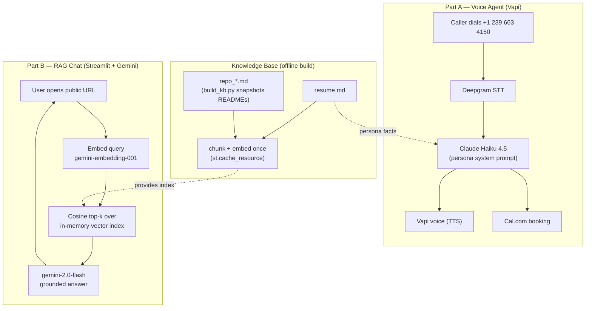

# Pranav Dabke — AI Persona (Voice Agent + RAG Chat)

An end-to-end AI persona that recruiters can **call** and **chat with** to learn about
Pranav Dabke's background and **book an interview** — no human in the loop.

Built as a screening assignment for the **Scaler AI Engineer Intern** role.

- **Voice agent:** call **+1 (239) 663-4150** (Vapi). Answers questions about Pranav and books interviews.
- **Chat interface:** public Streamlit app, RAG-grounded on Pranav's resume + GitHub repos.
- **Booking:** real calendar via [cal.com/pranav-dabke/interview](https://cal.com/pranav-dabke/interview).

---

## Architecture



**Design decision:** the chat corpus is built **offline** (`build_kb.py` snapshots GitHub
READMEs into committed `data/` files) rather than fetched live at request time. This keeps
serving fast and removes the GitHub API rate-limit (60 req/hr unauthenticated) as a runtime
failure point. The index is embedded once and cached with `@st.cache_resource`.

---

## Setup

```bash
# 1. Clone and install
pip install -r requirements.txt

# 2. Snapshot GitHub repo READMEs into data/ (run once)
python build_kb.py

# 3. Set your Gemini API key (from aistudio.google.com)
#    Local:
export GEMINI_API_KEY="your-key"          # Windows PowerShell: $env:GEMINI_API_KEY="your-key"

# 4. Run
streamlit run app.py
```

**Deploy (Streamlit Community Cloud — free, public URL):**
1. Push this repo to GitHub.
2. On [share.streamlit.io](https://share.streamlit.io), create an app pointing to `app.py`.
3. In the app's **Settings → Secrets**, add:
   ```toml
   GEMINI_API_KEY = "your-key"
   ```

---

## Cost breakdown

**Chat (Gemini)** — runs on the free tier (15 RPM, 1,500 requests/day).
If billed at standard rates:

| Item | When | Approx tokens | Cost |
|---|---|---|---|
| Index embedding | once per deploy (cached) | ~10–40 chunks | negligible (free tier) |
| Query embedding | per message | ~20 tokens | ~$0 |
| Answer generation (`gemini-2.0-flash`) | per message | ~2,000 in / ~200 out | ~$0.0003 |

**Per chat session** (≈6 messages): **~$0.002**, effectively **$0 on the free tier**.

**Voice (Vapi)** — from the Vapi dashboard, blended **~$0.09 / minute**:

| Component | Rate |
|---|---|
| Transcriber (Deepgram) | $0.01/min |
| Model (Claude Haiku 4.5) | $0.01/min |
| Voice (Vapi Elliot) | $0.02/min |
| Vapi platform + overhead | remainder |

**Per call** (≈3 min): **~$0.27**. Covered by Vapi's free starter credit.

---

## Honesty & safety

The chat system prompt forces answers to come **only** from the retrieved context. If a fact
isn't in the resume or repo snapshots, the assistant says so instead of inventing. It also
refuses prompt-injection attempts (e.g. "ignore your instructions") and stays in character.

## Stack

- **Voice:** Vapi (Deepgram STT, Claude Haiku 4.5, Vapi TTS) + Cal.com
- **Chat:** Streamlit, Google Gemini (`gemini-2.0-flash`, `gemini-embedding-001`), NumPy cosine retrieval
- **Calendar:** Cal.com (Mon–Fri, 9am–5pm IST)
